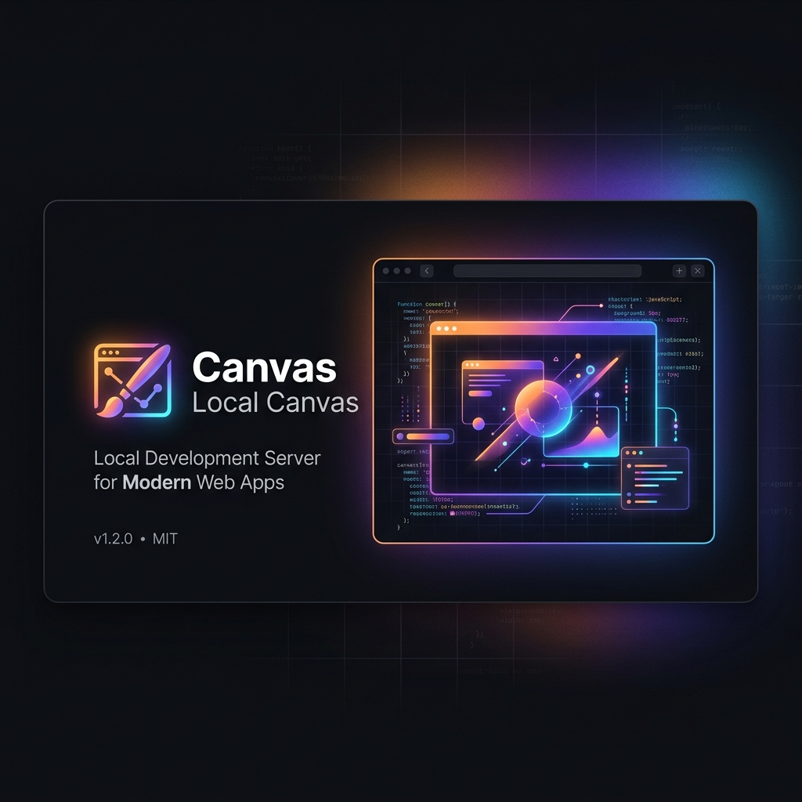

<p align="center">
  
</p>

<h1 align="center">🎨 CLC: Claude Local Canvas</h1>

<p align="center">
  <strong>Bring Artifacts-style live previews and real-time debugging to Claude Desktop.</strong>
</p>

<p align="center">
  <a href="https://modelcontextprotocol.io"></a>
  <a href="https://opensource.org/licenses/MIT"></a>
  <a href="https://github.com/salihtutun/claude-local-canvas/stargazers"></a>
  <a href="https://github.com/salihtutun/claude-local-canvas/issues"></a>
</p>

---

`claude-local-canvas` (**CLC**) is a Model Context Protocol (MCP) server that empowers Claude Desktop with a local preview sandbox, a background static web server, and an automated headless browser (powered by Puppeteer). 

When you ask Claude to design or build web interfaces, it writes the code directly to a local workspace, boots up a dev server, launches Chromium, and **streams screenshots of the rendered page back inline to your chat**. Even better, it listens to runtime JavaScript errors and resource failures, feeding them back to Claude so it can **self-correct and debug** its work in real-time.

---

## ✨ Key Features

*   📂 **Local Sandbox Workspace**: Write, edit, and maintain HTML, CSS, JS, and asset structures inside an isolated sandbox directory.
*   ⚡ **Dynamic Local HTTP Server**: Instantly serve code locally using standard, fast-routing HTTP protocols. Automatic port conflict resolution ensures it runs seamlessly.
*   📸 **Inline Chat Screenshot Previews**: High-resolution PNG captures are returned directly into your Claude Desktop client, giving you instant visual feedback.
*   🐞 **Self-Correction & Console Watcher**: Streams console outputs, syntax warnings, network resource failures, and uncaught exceptions back to the context window so Claude repairs bugs automatically.
*   🖱️ **Interactive Agent Tools**: Simulates actual user interactions like `click`, `type`, `scroll`, and `hover` on target elements, returning updated screenshots after each state change.
*   🔒 **Safe Path Traversal Protection**: Hardened sandbox constraints prevent directory traversal attacks, keeping your host system secure.

---

## 🚀 Installation & Setup

Set up your local canvas in less than 3 minutes.

### 1. Build the Server
Ensure you have [Node.js](https://nodejs.org/) (v18+) installed. Clone and build the project:

```bash
git clone https://github.com/salihtutun/claude-local-canvas.git
cd claude-local-canvas
npm install
npm run build
```

### 2. Connect to Claude Desktop

#### Option A: Automatic Setup (Recommended)
Simply run the setup command:
```bash
node dist/index.js --setup
```
This tool will automatically locate your Claude Desktop config file, inject the `claude-local-canvas` block with the correct paths, and back up your previous configuration.

#### Option B: Manual Setup
Open your Claude Desktop configuration file:
*   **macOS:** `~/Library/Application Support/Claude/claude_desktop_config.json`
*   **Windows:** `%APPDATA%\Claude\claude_desktop_config.json`

Add the server entry to your configuration:

```json
{
  "mcpServers": {
    "claude-local-canvas": {
      "command": "node",
      "args": [
        "/absolute/path/to/claude-local-canvas/dist/index.js"
      ]
    }
  }
}
```
> 💡 *Note: Remember to replace `/absolute/path/to/` with the exact path where you built the server on your computer.*

### 3. Relaunch Claude Desktop
Fully restart the Claude Desktop application (Cmd+Q on macOS or close from tray). A 🔌 icon will appear in the input box, indicating the tools are ready.

---

## 📖 Detailed Usage Guide

Once installed, you don't need to manually invoke tools. Claude is smart enough to use them automatically when you ask it to design, build, or preview layouts.

### Typical Workflow Flow
1. **Design Request**: You ask Claude to build a web component or single-page app (e.g., a modern Pomodoro timer).
2. **File Writing**: Claude automatically writes `index.html`, styles, and script files directly to your sandbox directory using `canvas_write_file`.
3. **Booting Server**: Claude starts the background static server using `canvas_start_server` to host your sandbox assets.
4. **Rendering & Screenshotting**: Claude launches the headless browser, navigates to the sandbox URL, captures a screenshot, and displays the image **inline inside your chat window** along with any browser console logs using `canvas_view_page`.
5. **Self-Correction (The Magic)**: If there are resource load failures or uncaught JavaScript exceptions, the console logger returns them to Claude. Claude reads the stack traces, modifies the files, and recaptures a screenshot until the code runs bug-free.

### Simulating User Actions
You can prompt Claude to interact with your app. For example:
* *"Click the dark mode button and show me what it looks like."*
* *"Enter 'Work Session' in the description input, select '30 minutes' from the dropdown, and click start."*

Claude will locate the target element, call `canvas_interact` to perform the action, and return a new screenshot showing the updated state of the page.

### ⚙️ Custom Configurations (Environment Variables)

You can customize the behavior of the server by adding the `env` block in your `claude_desktop_config.json`:

```json
"canvas-local-canvas": {
  "command": "node",
  "args": ["/absolute/path/to/claude-local-canvas/dist/index.js"],
  "env": {
    "CANVAS_SANDBOX_DIR": "/Users/salihtutun/custom-canvas-projects"
  }
}
```

* **`CANVAS_SANDBOX_DIR`**: Overrides the default workspace directory (`./sandbox`) with an absolute path on your host machine. Great for directing Claude to write files straight into your active code folders.
* **`DISABLE_CHROME_SANDBOX`**: Set to `"true"` to disable Chromium's security sandbox (equivalent to passing `--no-sandbox` to Puppeteer). Use this only if running in root-user Docker containers, headless environments, or CI setups where the Chrome sandbox cannot be run.

---

## 🛠️ Available MCP Tools

Once installed, Claude will utilize the following tools dynamically when prompted:

| Tool Name | Parameters | Description |
| :--- | :--- | :--- |
| `canvas_write_file` | `path` (str), `content` (str) | Writes or updates a code file inside the isolated sandbox workspace. |
| `canvas_read_file` | `path` (str) | Reads and returns the content of a file from the workspace. |
| `canvas_list_files` | (none) | Recursively lists all file trees and sizes inside the sandbox. |
| `canvas_start_server` | `port` (number, optional) | Starts the background web server on an available port. |
| `canvas_view_page` | `url` (optional), `width`, `height`, `annotate` (optional bool) | Loads the page in Chromium and returns base64 inline PNG + console outputs. If `annotate` is true, overlays numbered badges on interactive elements. |
| `canvas_interact` | `action` (enum), `selector` (CSS or badge ID), `value` | Interacts with elements (click, type, scroll, hover) by CSS selector or badge number (e.g. `"1"`) and returns the new UI state. |
| `canvas_stop_server` | (none) | Shuts down the background web server and closes active browser pages. |

---

## 💡 Example Prompts to Try

Start a chat with Claude Desktop and run:

*   **Create a beautiful game:**
    > *"Create an interactive, premium-designed Tic-Tac-Toe game with neon styling, score tracking, win animations, sound effects, and smooth transitions using the Claude Local Canvas tools."*
*   **Generate and check responsive layout:**
    > *"Build a modern grid dashboard for financial metrics with a dark mode toggle. Open the viewport at 375px width (mobile) to verify that the mobile layout displays perfectly."*
*   **Test and debug user flows:**
    > *"Open the current page, type 'admin@canvas.local' in the email box, type 'password123' in the password box, click the submit button, and let me see what happens."*

---

## 🔒 Security & Sandbox Isolation

To protect your host machine, CLC executes with hard security boundaries:

*   **Local Network Protection**: The static HTTP server binds strictly to the loopback interface (`127.0.0.1`). Devices on your local network (e.g. Wi-Fi, Ethernet) cannot access your sandbox files.
*   **Path Traversal Prevention**: The path resolver blocks any read/write operations attempting to escape the sandbox directory (e.g. by using `../` segments). Attempting to escape results in an immediate access error.
*   **Browser Sandboxing**: By default, the Chromium browser runs with full OS-level sandboxing. This shields your host system if the browser is directed to navigate to external/untrusted web pages.

---

## 🛠️ Troubleshooting & FAQ

### 1. Chrome/Puppeteer fails to start or gives "No Usable Sandbox" errors (Linux/Docker)
If you are running the MCP server inside a Docker container, headless server, or CI pipeline as the `root` user, Chromium may refuse to start because the OS-level sandbox is disabled.
*   **Solution**: Set the environment variable `DISABLE_CHROME_SANDBOX=true` in your Claude Desktop configuration file or system env. This is equivalent to passing `--no-sandbox` to Puppeteer. Only use this in isolated, trusted execution environments.

### 2. "EADDRINUSE" Port Conflicts
If port `3000` is already in use by another application on your computer, you do not need to do anything. The static server automatically detects the conflict, prints a message, and tries port `3001`, `3002`, etc., until it finds an open port.

### 3. Setup CLI fails to write configuration
If you run `node dist/index.js --setup` and receive a permission error:
*   Ensure that Claude Desktop is not running.
*   On macOS, ensure your terminal or IDE has permissions to access the directory `~/Library/Application Support/Claude`.

---

## 🤝 Contributing
Contributions are highly encouraged! Feel free to open issues or submit pull requests.
1. Fork the Project.
2. Create your Feature Branch (`git checkout -b feature/AmazingFeature`).
3. Commit your Changes (`git commit -m 'Add some AmazingFeature'`).
4. Push to the Branch (`git push origin feature/AmazingFeature`).
5. Open a Pull Request.

---

## 📄 License
Distributed under the MIT License. See `LICENSE` for more information.

---

<p align="center">
  Show your support by giving this project a ⭐ on GitHub!
</p>
